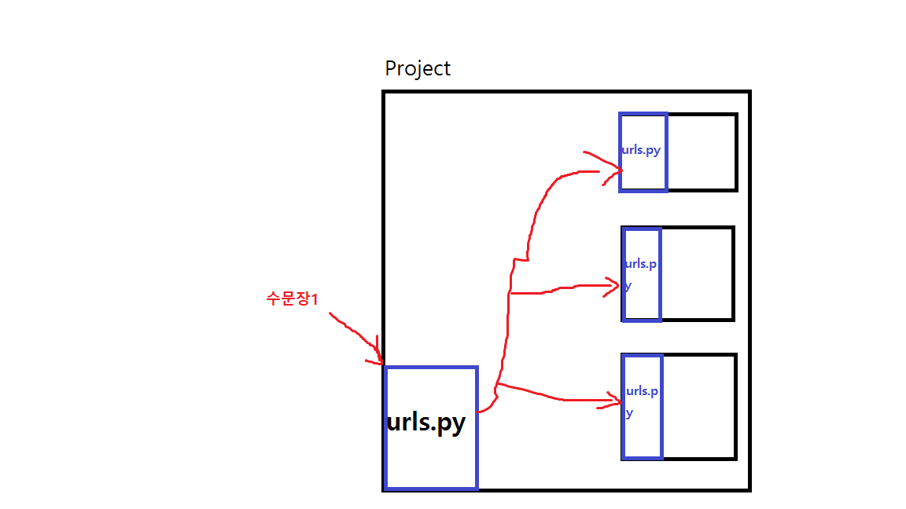

# Django
## URL
클라이언트가 서버에 요청을 보내는 주소.

클라이언트가 서버에 어떤 요청을 보내고 싶을때, 방법은 URL 쓰는 것 말고는 없다.

## Django
### MTV 패턴
- Model     : DB에 저장되는 데이터를 의미.
- Template  : 유저에게 보여지는 화면을 의미. (HTML 파일)
- View      : 요청에 따라 적절한 로직을 수행. (def 함수(request))

보통 다른 언어에서는 MVC패턴이라고 하나, 파이썬은 힙스터기질이 심한 사람들이 많아서
MTV패턴을 사용.

이를 아래처럼 표로 정리할 수 있음.

|MTV패턴|MVC패턴|설명|
|-|-|-|
|Model|Model|DB에 저장되는 데이터|
|Template|View|유저에게 보여지는 화면(HTML)|
|View|Controller|요청에 따른 로직을 수행.|

### Django 실습 전 명령어

```
$ django-admin startproject test    # project 시작
$ python manage.py                  # manage.py로 실행 가능한 명령 확인
$ python manage.py startapp         # app 시작 (settings.py 등록 필요)
```

### 데이터 입력 그림

서버를 건물에 비유하자면 위와 같다.

Project라 써져 있는 큰 건물이 Django에서 `django-admin startproject 플젝이름`으로 생성하는 그 project 맞다.

건물안에 각각의 urls.py로 가지는 각각의 부서들은 `python manage.py startapp 앱이름`으로 생성하는 그 app이다.

설명
1. 위 건물에서 저 수문장1이라고 적혀있는 urls.py가 최초로 url을 받는다. 
2. url에 포함된 앱 종류에 따라 각각의 앱 urls.py로 보낸다.
3. 각 앱의 urls.py에서는 view.py에 정의된 각종 함수들(로직)을 반환한다.
4. view.py에는 urls.py에서 호출된 메소드에 따라 template에 정의된 HTML파일을 내보낸다.

코드 예시
```python
# 수문장1 (Project의 urls.py)
from django.contrib import admin
from django.urls import path, include

urlpatterns = [
    path('admin/', admin.site.urls),
    path('review/', include('review.urls')), # review로 url이 오면 review.urls.py로 전송
    path('data/', include('data.urls')),    # data로 url이 오면 data.urls.py로 전송
]
```
```python
# urls.py
# URL 구성 맨 앞에 'review/'는 이미 master url에서 검사가 끝남.
urlpatterns = [
    # 패턴 '(review/)index/'가 요청으로 들어온다면, 
    path('index/', index, name='index'),
    path('hello/', hello, name='hello'),
]
```
```python
# views.py
from django.shortcuts import render

# Create your views here.
# URL이 review/index로 오면 review/hello_world.html을 반환
def index(request):
    return render(request, 'review/hello_world.html')


# URL이 review/hello로 오면 review/hello.html을 반환
def hello(request):
    return render(request, 'review/hello.html')

```

### Django 실습 과정
#### 실습 전 사전 준비
먼저 프로젝트를 생성한다.

```
$ django-admin startproject test
```
당연히 test는 프로젝트 이름이니까 아무렇게나 정해도 된다.

위처럼 프로젝트를 처음 생성하면 `test` 폴더랑 `manage.py` 파일 두개만 덩그러니 생성된다.

이제부터 모든 Django 프롬프트 명령어는 `manage.py`로 소통한다.

그 다음엔 `master_templates` 폴더를 만든다. 이 폴더는 HTML파일을 돌려쓰기 위한?(재사용을 위한) 폴더이다.

`master_templates` 폴더를 생성하고 나면, `settings.py`의 `Templates`의 `DIR` 항목에 해당 폴더의 경로에 적어 넣어야 한다.

```
$ cd ~/test
$ mkdir master_templates
```
```python
# BASE_DIR은 생성한 프로젝트의 기본 위치이다.
# 예를 들어, review 프로젝트를 생성했다면 BASE_DIR은 review 디렉토리의 위치를 말한다.
TEMPLATES = [
    {
        'BACKEND': 'django.template.backends.django.DjangoTemplates',
        # django는 기본적으로 app안에 templates/폴더에서 HTML을 찾음.
        'DIRS': [BASE_DIR / 'master_templates'],     # django가 추가로 HTML을 찾아볼 폴더 등록.
        'APP_DIRS': True,
        'OPTIONS': {
            'context_processors': [
                'django.template.context_processors.debug',
                'django.template.context_processors.request',
                'django.contrib.auth.context_processors.auth',
                'django.contrib.messages.context_processors.messages',
            ],
        },
    },
]
```

그리고 각 부서(앱)들을 만든다. 앱을 만들고나서는 프로젝트 시작과 동시에 생성된 `settings.py`의 `INSTALLED_APPS`에 해당 앱을 추가해야 한다.

그리고 HTML파일들을 모아놓을 `templates` 폴더도 추가하면 금상첨화.
```
$ python manage.py startapp review
$ cd review
$ mkdir templates
```
```python
# settings.py
INSTALLED_APPS = [
    'django.contrib.admin',
    'django.contrib.auth',
    'django.contrib.contenttypes',
    'django.contrib.sessions',
    'django.contrib.messages',
    'django.contrib.staticfiles',
    'review',                       # 이렇게 추가.
]
```
app들은 새로 생성될때마다 `INSTALLED_APPS`에 추가해야 한다.

여기까지 했다면 사전준비는 끝난다.

### 실습시작


## 23-01-05 강의 핵심 요약
1. 어제와 동일한 URL => View => Template
2. 앞으로 urls.py 에서 app_name = 'APP_NAME' 과 path('', views.func, name='PATTERN_NAME') 설정하기
3. 템플릿에서  으로 링크 생성 가능
4. App 마다 html 파일 이름이 겹칠경우 django에서 제대로 인식하지 못함
5. app/ > templates/ > app/ > html 파일들 방식으로 구분
6. 사용자 입력을 받아보자
