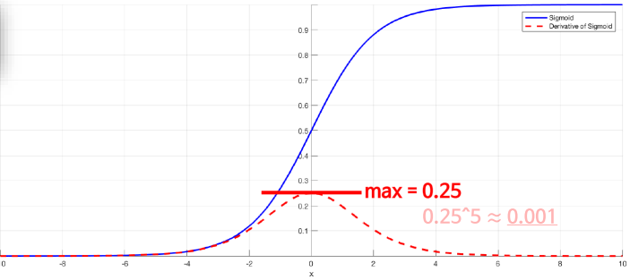
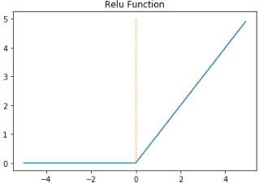
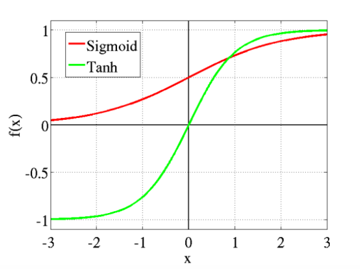

# 딥러닝
## 퍼셉트론
### 개념
인공신경망의 구성요소. 다수의 값을 입력받아 하나의 값으로 출력하는 알고리즘.

### 종류
1. 단층 퍼셉트론
- 은닉층 없이 입력층과 출력층만 있는 경우를 단층 퍼셉트론이라고 함.
- AND, NAND, OR 게이트를 구현할 수 있지만, XOR 게이트는 구현 불가.

2. 다층 퍼셉트론
- 은닉층이 1개 이상 존재하는 경우를 다층 퍼셉트론이라고 함.
- AND, OR, NAND 게이트를 조합하여 XOR게이트 구현 가능.
- 일반적으로 은닉층이 2개 이상인 퍼셉트론을 심층신경망(Deep Neural Network, DNN)이라고 부름.

## 딥러닝
- 위에서도 설명했듯, 은닉층이 2개 이상인 퍼셉트론을 딥러닝이라고 함.
- 항상 그런것은 아니지만, 데이터 수 (row)가 10만개가 넘어가는 시점에서는 딥러닝이 깡패.

### 머신러닝 vs 딥러닝
| 알고리즘              | 머신러닝                       | 딥러닝                               |
| --------------------- | ------------------------------ | ------------------------------------ |
| Feature               | 사람이 직접 특징 지정          | 지가 알아서 특징을 찾음              |
| 데이터 수             | 10만개 미만에서 강력한 성능    | 10만개 이상의 데이터에서 강력한 성능 |
| 성능 높이는 주요 요인 | 최대한 필요한 것만 가져가야함. | 과적합 막아내기                      |

### 활성함수 (Activation Function)
이전 레이어의 모든 입력에 대한 가중 합을 받아 출력값을 생성하여 다음 레이어로 전달하는 비선형 함수.

**활성함수가 비선형 함수여야만 하는 이유** : 활성함수가 선형 함수면 은닉층을 나누는 이유가 없다. 즉, 그냥 회귀식이랑 똑같음.

#### 종류
여러가지가 있지만 대표적으로 세 가지가 있다.

1. 시그모이드 함수 (Sigmoid Function)
   
    
   1. 이렇게 생겼다. 
   2. 미분하면 양쪽으로 향할수록 변화값이 거의 없음. => 오차역전파법 사용하면 Vanishing Grandient 현상 발견.
   3. 잘 사용안함.

2. ReLu (Rectified Linear Unit, 정류 선형 단위)
    
    
   1. x가 0보다 작으면 0, 0보다 크면 입력값을 출력
   2. 음수 값이 들어오는 경우 죄다 0으로 반환하다보니, 기울기도 모조리 0으로 나오게 된다.
   3. 현재 가장 많이 사용되는 활성함수 종류. => 단점을 보완한 파생 활성함수의 종류도 여러가지가 있다.

3. 쌍곡선 함수 (hyperbolic Tangent, 줄여서 tanh)
    
    
   1. x가 0보다 작으면 -1 ~ 0, 0보다 크면 0 ~ 1 출력
   2. 출력값의 범위를 음수로 확장했을 뿐, 시그모이드의 단점을 그대로 가져간다.
   3. 자연어 처리에서 ReLu보다 성능이 좋을 때가 있어 종종 쓰인다.

