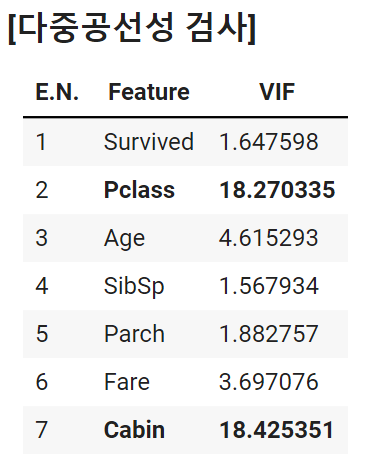

# 다중공선성 (multicollinearity)
   
## 정의
독립 변수의 일부가 다른 독립 변수의 조합으로 표현될 수 있는 경우. 혹은, 각 독립변수들 사이에 강력한 상관관계가 존재하여, 회귀분석 시 결과를 왜곡하는 현상.

## 탐색
기본적으로 분산팽창요인(Variance Inflation Factor)을 사용하여 탐색한다.
VIF의 값이 10을 넘는 변수는 다중공선성이 존재하는 변수로 간주한다.

 

**[예시]**

column에 전처리를 살짝 가한 Titanic 데이터에 `statsmodels` 라이브러리의 `variance_inflation_factor` 함수를 사용하여 각 독립변수 간 VIF값을 구한 예시이다.

위의 값을 살펴보면 Pclass 열과 Cabin 열의 값이 10을 넘는 18.27, 18.43을 기록하여 다중공선성이 존재하는 것으로 확인된다.

해석적인 측면에서는, Pclass와 Cabin 둘 중에 하나를 없앨 것을 권장하지만, 다중공선성이 존재하는 feature들을 삭제하는 것이 무조건적으로 분류기의 성능 향상으로 이어지지는 않기 때문에, 해당 feature 삭제는 분류기의 성능 평가를 우선 내보고 삭제할지 말지를 결정하는 것이 요즘 추세인 듯 하다. 

[한 feature라도 더 사용해서 조금이라도 성능을 개선하는게 목적인듯 함.]

## 결론
데이터에 대해 좀 더 살펴보고 싶은 거라면 => 다중공선성 feature 삭제

머신러닝을 직접 돌리고 싶은 거라면 => 성능 평가 내보고 삭제할지 말지 결정.